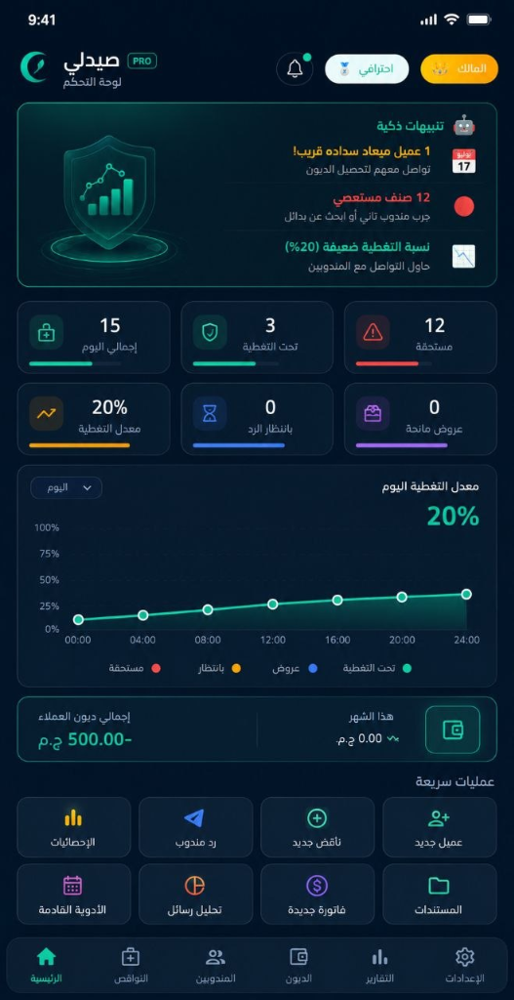
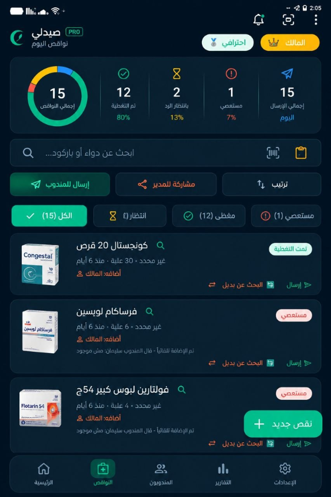
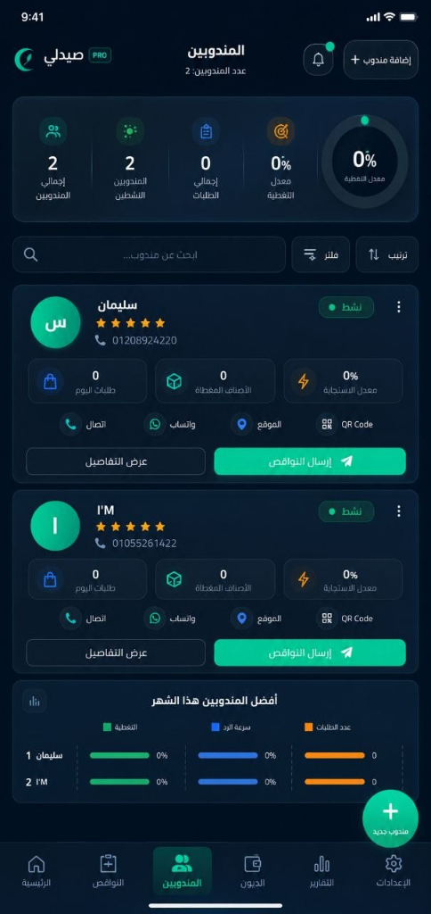
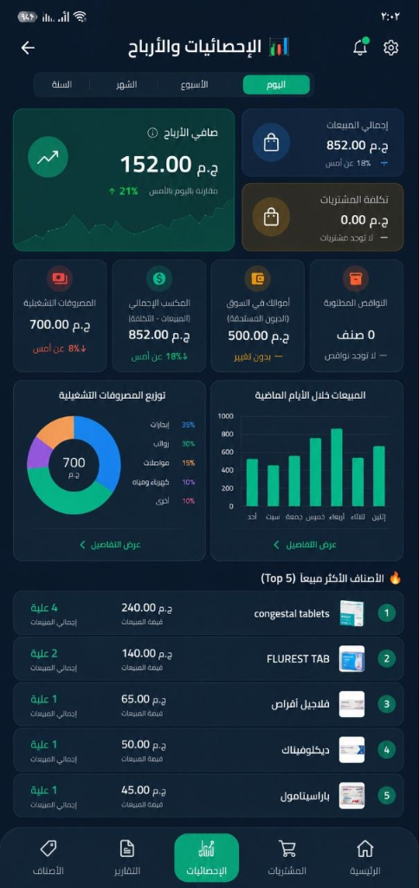
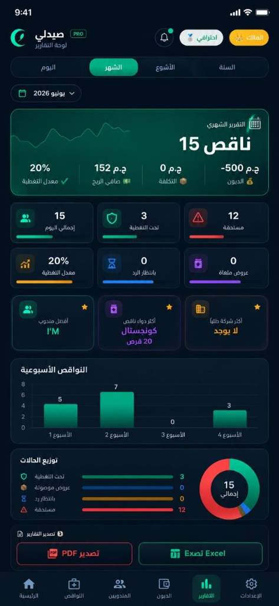
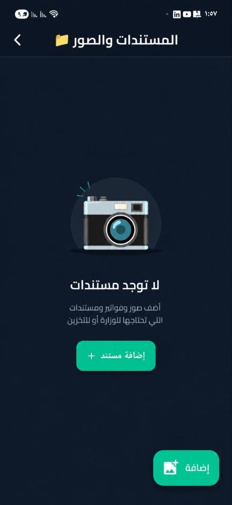

# صيدلي برو - Saydali Pro 🚀
### النظام الرقمي المتكامل لإدارة وتأمين الصيدليات الذكية (Offline-First & Cloud Sync)

**صيدلي برو** هو منصة برمجية متكاملة مصممة خصيصاً لإدارة صيدليتك بكفاءة فائقة. يجمع التطبيق بين قوة الأداء المحلي الكامل (Offline-First) لضمان استمرارية العمل دون انقطاع، وبين المزامنة السحابية اللحظية لمتابعة صيدليتك من أي مكان وفي أي وقت.

---

## 📱 لقطات الشاشة (Screenshots)

<div align="center">

| لوحة التحكم | النواقص | المندوبون |
|:-----------:|:-------:|:---------:|
|  |  |  |

| الإحصائيات والأرباح | التقارير الشهرية | الرئيسية |
|:-------------------:|:----------------:|:--------:|
|  |  |  |

</div>

---

## 📋 دليل المميزات الشاملة والتفصيلية للتطبيق

يحتوي التطبيق على حزمة ضخمة من الميزات المترابطة التي تدير شؤون الصيدلية المالية، التشغيلية، والرقابية:

### 1️⃣ تفاعلية النواقص والمندوبين الذكية (ميزة رابط الويب السحري) 🔗
هذه الميزة هي الثورة التكنولوجية للتطبيق، حيث تتيح إدارة الطلبيات وعروض الأسعار دون أوراق أو رسائل يدوية مبعثرة:

* **آلية إنشاء الرابط وإرساله للمندوب (ماذا يحدث وكيف ولماذا؟)**:
  * **الخطوة 1 (التجميع والاختيار)**: يقوم الصيدلي بفتح شاشة النواقص وتحديد الأصناف المطلوبة للطلب لشركة أو مندوب محدد.
  * **الخطوة 2 (إنشاء الجلسة السحابية)**: عند الضغط على "إرسال للمندوب"، يقوم التطبيق بالاتصال بـ Supabase وإنشاء **جلسة فريدة ومؤمنة (Session)** تحتوي على قائمة النواقص المحددة، الكميات المطلوبة، واسم الصيدلية وعملتها.
  * **الخطوة 3 (إنشاء رابط الويب الفريد)**: يقوم التطبيق بتوليد رابط ويب مشفر يحتوي على معرّف الجلسة (Session Code) مثل:
    `https://mohamedelsayed1475-wq.github.io/saydali-app1/?code=SESSION_CODE`
  * **الخطوة 4 (الإرسال الفوري عبر واتساب)**: يفتح التطبيق تلقائياً تطبيق واتساب ببرمجة مباشرة مع رقم المندوب، حاملاً رسالة ترحيبية مهيأة مسبقاً تحتوي على رابط الجلسة.
  * **الخطوة 5 (تفاعل المندوب عبر الويب)**: يفتح المندوب الرابط من أي متصفح (على هاتفه أو كمبيوتره) دون الحاجة لتحميل التطبيق أو تسجيل حساب. تظهر له قائمة النواقص ويمكنه تفاعلياً إدخل:
    * **السعر المعروض (Price)** لكل علبة.
    * **نسبة الخصم (Discount %)** المتوفرة.
    * **حالة التوفر (Available/Not Available)**.
    * **ملاحظات خاصة** بكل صنف (مثل: "سعر قديم"، "متاح حصة محدودة").
  * **الخطوة 6 (استقبال وتحليل العروض)**: عند ضغط المندوب على "حفظ وإرسال"، تُحفظ البيانات فوراً في قاعدة البيانات السحابية. يظهر إشعار في تطبيق الصيدلي، ليقوم بفتح شاشة **استقبال ردود المندوبين** لمراجعة الأسعار والخصومات واعتمادها بضغطة زر وتخزينها محلياً في جدول الردود لفلترة أفضل الأسعار.
  * **معالجة النواقص غير المتوفرة**: إذا حدد المندوب صنفاً بأنه "غير متوفر"، يقوم التطبيق تلقائياً بتحديث حالة الناقص في الصيدلية إلى **مستعصي (Stubborn)** لتنبيه الصيدلي بالبحث عن بديل فوري.

* **استيراد جهات الاتصال**: إمكانية تسجيل المندوبين واستيراد بياناتهم وأرقام هواتفهم بضغطة واحدة من جهات اتصال الهاتف المحمول مباشرة.
* **البحث البصري للنواقص**: زر مدمج بكل صنف ناقص للبحث الفوري عن صور العلبة في Google Images لمساعدة المساعدين الجدد على التعرف البصري على الدواء.
* **مفسر وقارئ رسائل المندوبين (AI Message Parser)**: في حال أرسل المندوب قائمة أسعاره كنص على واتساب، يتيح التطبيق نسخ النص ولصقه ليقوم التطبيق بمساعدة الذكاء الاصطناعي بقراءة النص واستخراج أسعار الأدوية والخصومات وإضافتها للردود تلقائياً.

---

### 2️⃣ إدارة النواقص والبدائل الذكية 📦
* **إضافة النواقص وتصنيفها**: تسجيل النواقص وتحديد الكمية والشركة وتصنيفها كـ "عاجل" أو "عادي".
* **البحث بالبدائل (Alternatives Engine)**: محرك محلي مدمج يقترح البدائل والبدائل المثيلة للأدوية الناقصة بناءً على المادة الفعالة، وهو مفلتر تلقائياً حسب كود دولة الصيدلية (مصر، السعودية، إلخ).
* **تتبع دورة حياة الناقص**: حالات مختلفة تضمن تنظيم العمل (معلق `pending` ، معروض `offered` ، مغطى `covered` ، مستعصي `stubborn`).

---

### 3️⃣ إدارة حسابات العملاء والديون والتحصيل 💳
* **ملف متكامل للعميل**: لكل عميل ملف يحتوي على اسمه، هاتفه، عنوانه، صورته الشخصية، وإجمالي مديونيته الحالية.
* **سجل تفصيلي للحركات**: تتبع دقيق لكل معاملة دين (سحب أصناف بالآجل) أو سداد (دفع كلي أو جزئي)، مع إمكانية تصوير وإرفاق إيصال الدفع.
* **استيراد العملاء من الهاتف**: استيراد العملاء مباشرة من جهات الاتصال الخاصة بالهاتف.
* **تذكيرات الديون الذكية**: زر مخصص يقوم بصياغة رسالة واتساب مهذبة تحتوي على اسم العميل وإجمالي المديونية وتاريخ الاستحقاق وإرسالها بضغطة زر.
* **تنبيهات تاريخ الاستحقاق**: نظام إنذار محلي لتنبيه الصيدلي بالعملاء المتأخرين عن السداد.

---

### 4️⃣ نقطة البيع وفواتير المبيعات (POS) 🧾
* **الكاشير السريع**: شاشة بيع ذكية تبحث في قائمة الأدوية بالاسم الإنجليزي أو العربي مع اقتراحات ذكية وسريعة.
* **قارئ الباركود (Barcode Scanner)**: مسح باركود الدواء بكاميرا الهاتف للوصول السريع للصنف وإضافته للفاتورة مباشرة.
* **خيارات سداد متعددة**:
  * **نقدي (Cash)** بالكامل.
  * **آجل بالكامل (Full Debt)** يُسجل مباشرة على حساب عميل محدد.
  * **سداد جزئي (Partial Debt)** (دفع جزء نقداً وتقسيط المتبقي كدين على العميل).
* **توليد وطباعة الفواتير PDF**: إصدار فواتير بيع احترافية بصيغة PDF قابلة للطباعة الفورية على الطابعات الحرارية (Thermal Printers) أو مشاركتها كملف عبر وسائل التواصل.

---

### 5️⃣ إدارة صلاحيات المساعدين والرقابة الكاملة (Security & Activity Logs) 🔐
* **تأمين الدخول (PIN Lock)**: تسجيل دخول المالك والمساعدين برقم PIN سري فريد لكل مستخدم لحماية الخصوصية.
* **صلاحيات تفصيلية ودقيقة**: يستطيع المالك التحكم في شاشات وصلاحيات كل مساعد على حدة وتشمل:
  * صلاحية إضافة الديون.
  * صلاحية تعديل الديون (مغلقة افتراضياً للمساعدين لمنع التلاعب).
  * صلاحية حذف أي سجل.
  * صلاحية إدارة الفواتير والمبيعات.
  * صلاحية إدارة النواقص والبدائل.
  * صلاحية إدارة المندوبين.
  * صلاحية عرض التقارير المالية والأرباح.
* **سجل الرقابة والنشاطات (Activity Log)**: يسجل التطبيق كل خطوة يقوم بها المساعد بالتفصيل (مثل: "قام [أحمد] بحذف العميل [محمد]" أو "قام [محمود] بتعديل فاتورة") مع تسجيل التاريخ والوقت بدقة متناهية، لحفظ الحقوق وضمان الشفافية الكاملة.
* **هوية المُعدِّل (Created By)**: تسجيل اسم من قام بإجراء الإضافة أو التعديل (سواء المالك أو مساعد معين) وعرضه بشكل شارات ذكية على كروت النواقص، العملاء، معاملات الديون، الفواتير، صلاحيات الأدوية، وطلبات المندوبين.

---

### 6️⃣ إدارة صلاحيات وانتهاء الأدوية (Medication Expiry) 📅
* **متابعة صلاحية المخزون**: تسجيل الأدوية، كمياتها، تواريخ انتهائها، والمورد الخاص بها.
* **نظام التنبيه اللوني**:
  * **أحمر**: منتهي الصلاحية فوراً.
  * **برتقالي**: حرج (متبقي أقل من 3 أشهر).
  * **أهله (أصفر)**: تحذير (متبقي أقل من 6 أشهر).
  * **أخضر**: آمن.
* **التحديث التلقائي بالبيع**: زر "تم البيع" لخصم الكميات المباعة من المخزون التالف أو القريب انتهائه لضمان دقة القوائم.

---

### 7️⃣ الإدارة المالية والمصروفات والتقارير 📊
* **تسجيل المصروفات**: تصنيف المصاريف اليومية والتشغيلية (إيجار، كهرباء، رواتب، أكياس) لحساب الأرباح الصافية بدقة.
* **إحصائيات ورسوم بيانية**: شاشة تقارير مالية تعرض رسوم بيانية تفاعلية للمبيعات والأرباح والمصروفات أسبوعياً وشهرياً.
* **تصدير التقارير**: إمكانية تصدير قوائم النواقص والتقارير المالية كملفات Excel احترافية.

---

### 8️⃣ المزامنة السحابية والبنية التحتية (Sync & Architecture) ☁️
* **بنية Offline-First**: التطبيق يعمل بكامل طاقته ومميزاته محلياً وبسرعة فائقة حتى لو انقطع الإنترنت تماماً داخل الصيدلية.
* **المزامنة مع Supabase**: عند توفر الإنترنت، يتم مزامنة البيانات تلقائياً أو يدوياً بين كافة الأجهزة المتصلة بالصيدلية (هاتف المالك، أجهزة المساعدين) في ثوانٍ معدودة.
* **حماية البيانات القصوى (RLS Policies)**: تطبيق سياسات حماية صارمة على مستوى الصف في Supabase لضمان ألا يتمكن أي جهاز خارجي من قراءة بيانات صيدليتك إلا إذا كان مسجلاً رسمياً ولديه الـ UUID الآمن للصيدلية.

---

## 📂 الهيكل التنظيمي للمشروع (Structure)
```text
lib/
├── main.dart                      # نقطة الإقلاع الأساسية للتطبيق وتهيئة المكاتب والخدمات
├── database/
│   └── database_helper.dart       # مدير قاعدة البيانات المحلية (SQLite) لإنشاء الجداول والترقيات والعمليات
├── models/
│   └── models.dart                # نماذج البيانات (النواقص، المندوب، العميل، الفاتورة، المصروفات، البدائل)
├── providers/                     # إدارة حالة التطبيق (State Management)
│   ├── app_providers.dart         # مزودي الحالة العامة للتطبيق
│   └── current_user_provider.dart # مزود حالة المستخدم الحالي (مدير/مساعد) وصلاحياته
├── screens/                       # شاشات واجهة المستخدم
│   ├── alternatives_screen.dart   # شاشة إدارة الأدوية البديلة والبحث عنها
│   ├── assistant_pin_login_screen.dart # تسجيل دخول المساعد باستخدام PIN
│   ├── assistants_screen.dart     # إدارة حسابات وصلاحيات المساعدين
│   ├── dashboard_screen.dart      # لوحة التحكم الرئيسية والإحصائيات السريعة
│   ├── debts_screen.dart          # شاشة حسابات وديون العملاء وتكامل جهات الاتصال
│   ├── dev_panel_screen.dart      # لوحة المطورين لاختبار الميزات والإعلانات
│   ├── documents_screen.dart      # إدارة المستندات وتراخيص الصيدلية
│   ├── expenses_screen.dart       # شاشة إدارة وتسجيل المصروفات
│   ├── invoice_screen.dart        # شاشة إنشاء وإدارة الفواتير ونقطة البيع (POS)
│   ├── medication_expiry_screen.dart # إدارة وتنبيهات تواريخ انتهاء صلاحية الأدوية
│   ├── pin_lock_screen.dart       # شاشة القفل بالرقم السري للمدير لحماية البيانات
│   ├── platform_settings_screen.dart # إعدادات المنصة والجهاز المتقدمة
│   ├── rep_details_screen.dart    # تفاصيل المندوب وتقييمه وعروضه وسجله
│   ├── rep_message_parser_screen.dart # استيراد ردود المندوبين من نصوص الرسائل تلقائياً
│   ├── rep_response_screen.dart   # استقبال ومراجعة تسعيرات وعروض المندوبين
│   ├── reports_screen.dart        # تقارير المبيعات والنواقص والرسوم البيانية
│   ├── reps_screen.dart           # إدارة المندوبين وتكامل جهات الاتصال
│   ├── scanner_screen.dart        # مسح الباركود باستخدام الكاميرا
│   ├── send_to_rep_screen.dart    # إرسال طلبات النواقص للمندوب عبر جلسات Supabase
│   ├── settings_screen.dart       # إعدادات التطبيق والمظهر وقفل الأمان وتحديد الدولة
│   ├── shortages_screen.dart      # إدارة الأدوية الناقصة مع اقتراحات البدائل
│   ├── statistics_screen.dart     # إحصائيات تفصيلية ورسوم بيانية
│   ├── subscription_screen.dart   # تفعيل الاشتراكات وتفعيل الأكواد
│   ├── sync_schedule_screen.dart  # جدولة المزامنة التلقائية مع السحابة
│   └── user_selection_screen.dart # شاشة اختيار نوع المستخدم عند الفتح
├── services/                      # خدمات الاتصال الخارجي والنظام
│   ├── notification_service.dart  # نظام التنبيهات المحلية للأدوية والديون
│   ├── openfda_service.dart       # سحب البدائل والمعلومات الدوائية من OpenFDA
│   ├── platform_service.dart      # خدمات للتعامل مع المنصة أو الجهاز
│   ├── rxnorm_service.dart        # خدمة RxNorm للتحقق من المكونات الفعالة والأدوية
│   ├── scheduled_sync_service.dart# مزامنة البيانات المجدولة تلقائياً مع السحابة
│   ├── supabase_service.dart      # خدمة الاتصال بـ Supabase لجلسات المندوبين والاشتراكات والمزامنة
│   └── sync_service.dart          # إدارة عمليات مزامنة الجداول السحابية والمحلية
└── utils/                         # أدوات مساعدة عامة
    ├── app_theme.dart             # نظام الألوان والسمات الخاصة بالتطبيق (ثيم داكن/مضيء)
    ├── country_config.dart        # إعدادات وتكوينات الدول المدعومة في التطبيق
    ├── env_config.dart            # إعدادات البيئة ومفاتيح الـ API السرية
    ├── fuzzy_search.dart          # خوارزمية البحث التقريبي لترتيب وتصفية النتائج
    └── security_helper.dart       # أدوات التشفير وحماية البيانات الحساسة
```

---

## 🛠️ التقنيات المستخدمة
تم بناء التطبيق باستخدام إطار عمل **Flutter** مع لغة **Dart**، بالاعتماد على المكاتب والحزم الأساسية التالية:

* **قاعدة البيانات والتخزين:** `sqflite` (للتخزين المحلي)، `path`.
* **إدارة الحالة:** `provider`.
* **الخدمات السحابية:** `http` (للاتصال بـ Supabase والمزامنة).
* **جهات الاتصال والتكامل:** `flutter_contacts` (لإضافة العملاء والمندوبين مباشرة من الهاتف).
* **الذكاء الاصطناعي:** `google_generative_ai` و `google_mlkit_text_recognition`.
* **الواجهة والرسوميات:** `flutter_slidable`, `fl_chart`, `google_fonts`.
* **الملفات والطباعة:** `pdf`, `printing`, `excel`, `file_picker`, `syncfusion_flutter_pdf`.
* **أدوات النظام والأمان:** `mobile_scanner`, `qr_flutter` (للباركود)، `flutter_local_notifications`, `share_plus`, `crypto` (تشفير وقفل).
